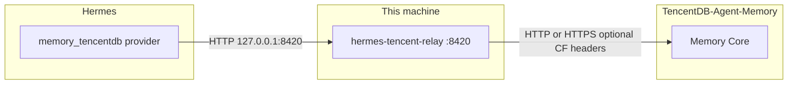

# Hermes Tencent Relay

Local HTTP relay so Hermes can reach **your** [TencentDB Agent Memory](https://github.com/TencentCloud/TencentDB-Agent-Memory) **Memory Core** (default port `8420`).

This plugin is **not** the hub. It sits on your machine, listens on loopback, and forwards every request to your Memory Core. Hermes's `memory_tencentdb` provider talks HTTP to `127.0.0.1:8420` — use this relay when the Core runs elsewhere (another host, HTTPS, or behind Cloudflare Access).

> **Already have Memory Core on this machine at `127.0.0.1:8420`?** Skip this plugin (it would collide on the port). Run `hermes memory setup memory_tencentdb` against the local Core instead.

## Architecture



## Connection modes

### Direct (default)

Point the relay at your Memory Core URL — LAN, VPN, public HTTPS, whatever reaches the hub:

```
http://192.168.1.10:8420
https://memory.example.com
```

Leave Cloudflare fields blank. The relay forwards requests verbatim; Hermes supplies the gateway Bearer token.

### Cloudflare Access (optional)

If your hub is behind Cloudflare Tunnel with Access Service Auth, set the same URL plus a Cloudflare Service Token during `hermes tencent-relay setup`. The relay adds `CF-Access-Client-Id` / `CF-Access-Client-Secret` headers on every upstream request.

## Prerequisites

1. A running [TencentDB Agent Memory](https://github.com/TencentCloud/TencentDB-Agent-Memory) deployment — see [INSTALL.md](https://github.com/TencentCloud/TencentDB-Agent-Memory/blob/feat/server_team/INSTALL.md).
2. Hermes 2.0+ with the `memory_tencentdb` provider installed from the hub repo (not bundled in Hermes by default):

   ```bash
   # Symlink or copy from the hub checkout:
   ln -sf /path/to/TencentDB-Agent-Memory/hermes-plugin/memory/memory_tencentdb \
         ~/.hermes/plugins/memory_tencentdb
   ```

Default hub ports (for reference):

| Service | Port |
|---|---|
| Memory Core | `8420` |
| Panel UI | `8125` |
| Knowledge | `8424` |
| LLM Proxy | `8096` |

This plugin relays **Memory Core only**. The LLM Proxy path (`model.provider: custom` on port `8096`) is configured separately — see Tencent's INSTALL.md.

## Install

```bash
hermes plugins install hermes-tencent-relay
```

Enable the plugin via the interactive plugin manager:

```bash
hermes plugins
```

Toggle **hermes-tencent-relay** on in the General Plugins section (SPACE, then ESC to save).

## Quick Start

```bash
# 1. Configure relay → your Memory Core
hermes tencent-relay setup

# 2. Start the relay
hermes tencent-relay start

# 3. Verify upstream is reachable through the relay
hermes tencent-relay health

# 4. Configure Hermes memory (interactive wizard)
hermes memory setup memory_tencentdb

# 5. Optional: auto-start on boot
hermes tencent-relay enable
```

When `hermes memory setup memory_tencentdb` prompts:

| Field | Value (when using this relay) |
|---|---|
| Gateway command | `/bin/true` (prevents Hermes from spawning a competing local gateway) |
| Gateway host | `127.0.0.1` |
| Gateway port | relay listen port (default `8420`) |
| Gateway API key | hub `user_key` from the admin panel |
| LLM fields | your hub's LLM settings (required by the wizard) |

## CLI Reference

| Command | Description |
|---|---|
| `hermes tencent-relay setup` | Interactive config: Memory Core URL, optional CF tokens, listen port |
| `hermes tencent-relay status` | Show relay running state |
| `hermes tencent-relay health` | Health check via relay (`/health`, then `/api/health`) |
| `hermes tencent-relay start` | Start relay as background process |
| `hermes tencent-relay stop` | Stop relay gracefully |
| `hermes tencent-relay enable` | Install systemd (Linux) or launchd (macOS) auto-start |
| `hermes tencent-relay disable` | Stop + disable auto-start |

## Configuration

Config stored at `~/.hermes/state/hermes-tencent-relay.json` (mode `600`):

| Field | Default | Description |
|---|---|---|
| `upstream_url` | *(empty — required)* | Memory Core URL (`http://host:8420` or `https://…`) |
| `cf_client_id` | `""` | Cloudflare Access Service Token ID (optional) |
| `cf_client_secret` | `""` | Cloudflare Access Service Token Secret (optional) |
| `listen_host` | `127.0.0.1` | Relay listen address (loopback only) |
| `listen_port` | `8420` | Relay listen port |

Environment variable overrides: `TENCENT_RELAY_*` (see `server/relay.py`).

## Requirements

- Python 3.10+ (stdlib only — no pip dependencies)
- Hermes 2.0+ with `memory_tencentdb` provider from [TencentDB-Agent-Memory](https://github.com/TencentCloud/TencentDB-Agent-Memory)

## Files

```
~/.hermes/plugins/hermes-tencent-relay/
├── plugin.yaml                    # Hermes plugin manifest
├── __init__.py                    # CLI registration + entrypoint
├── hermes_plugin/
│   └── runtime.py                 # Process management + service integration
├── server/
│   └── relay.py                   # HTTP relay server (stdlib only)
├── templates/
│   ├── hermes-tencent-relay.service    # systemd unit (Linux)
│   └── com.hermes.tencent-relay.plist  # launchd plist (macOS)
└── docs/README.md                 # This file
```

## Security

- **Loopback only** — default listen address is `127.0.0.1`; only local processes reach the relay
- **Optional Cloudflare Access** — edge auth when your hub requires it; unused by default
- **Bearer token passthrough** — Hermes provides the gateway API key; the relay proxies it unchanged
- Config file is written with `chmod 600`

## Troubleshooting

| Symptom | Fix |
|---|---|
| `upstream URL not configured` | Run `hermes tencent-relay setup` |
| `Connection refused` on health | Relay not running — `hermes tencent-relay start` |
| Health fails, relay running | Check Memory Core URL; test `curl <upstream_url>/health` directly |
| CF 403 / redirect loop | Verify Cloudflare Service Token in setup |
| Port already in use | Another process (maybe local Memory Core) owns `:8420` — change `listen_port` or skip the relay |
| Logs | `~/.hermes/state/hermes-tencent-relay.log` |
